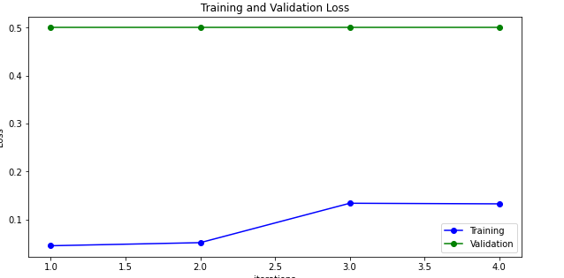
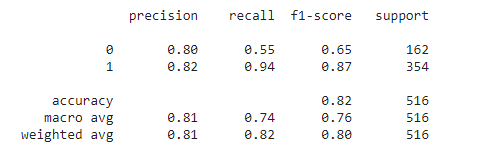
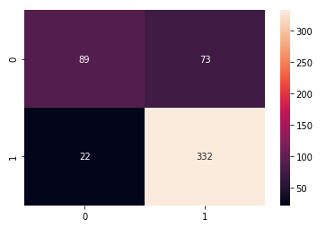
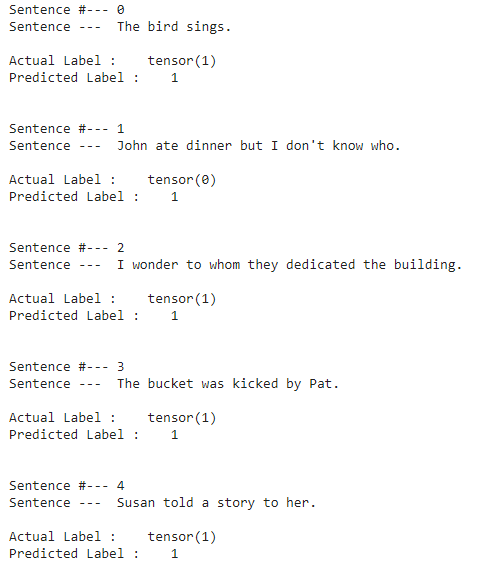

# tsai_end2_session14

# Session 14

- [What is BERT?](#what-is-bert-?)

BERT (Bidirectional Encoder Representations from Transformers) is a recent paper published by researchers at Google AI Language. BERT is designed to help computers understand the meaning of ambiguous language in text by using surrounding text to establish context. The BERT framework was pre-trained using text from Wikipedia and can be fine-tuned with question and answer datasets.


- Train & Valid Loss




- Precision & Recall



- Confusion Matrix




- Sentence Example




- [Fine tuning](#fine-tuning)
```

Epoch 1 / 4
  Batch    40  of    241.    Elapsed: 0:00:14.
  Batch    80  of    241.    Elapsed: 0:00:29.
  Batch   120  of    241.    Elapsed: 0:00:44.
  Batch   160  of    241.    Elapsed: 0:00:58.
  Batch   200  of    241.    Elapsed: 0:01:13.
  Batch   240  of    241.    Elapsed: 0:01:27.

  Average loss during train loops: 0.05
  Training epcoh time: 0:01:27
 Accuracy  the model: 0.87
  Validation Loss: 0.50
  Validation took: 0:00:03

Epoch 2 / 4
  Batch    40  of    241.    Elapsed: 0:00:14.
  Batch    80  of    241.    Elapsed: 0:00:29.
  Batch   120  of    241.    Elapsed: 0:00:43.
  Batch   160  of    241.    Elapsed: 0:00:58.
  Batch   200  of    241.    Elapsed: 0:01:12.
  Batch   240  of    241.    Elapsed: 0:01:27.

  Average loss during train loops: 0.05
  Training epcoh time: 0:01:27
 Accuracy  the model: 0.87
  Validation Loss: 0.50
  Validation took: 0:00:03

Epoch 3 / 4
  Batch    40  of    241.    Elapsed: 0:00:14.
  Batch    80  of    241.    Elapsed: 0:00:29.
  Batch   120  of    241.    Elapsed: 0:00:44.
  Batch   160  of    241.    Elapsed: 0:00:58.
  Batch   200  of    241.    Elapsed: 0:01:13.
  Batch   240  of    241.    Elapsed: 0:01:27.

  Average loss during train loops: 0.13
  Training epcoh time: 0:01:28
 Accuracy  the model: 0.87
  Validation Loss: 0.50
  Validation took: 0:00:03

Epoch 4 / 4
  Batch    40  of    241.    Elapsed: 0:00:15.
  Batch    80  of    241.    Elapsed: 0:00:29.
  Batch   120  of    241.    Elapsed: 0:00:44.
  Batch   160  of    241.    Elapsed: 0:00:58.
  Batch   200  of    241.    Elapsed: 0:01:13.
  Batch   240  of    241.    Elapsed: 0:01:27.

  Average loss during train loops: 0.13
  Training epcoh time: 0:01:28
 Accuracy  the model: 0.87
  Validation Loss: 0.50
  Validation took: 0:00:03
Total training time 0:06:03 (h:mm:ss)

```


- [Team](#team)
- Debasish Sarangi
- Anirban Mukherjee
- Smruthi 
